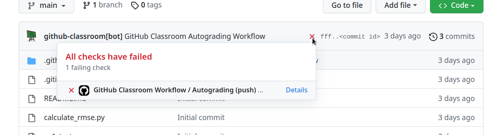
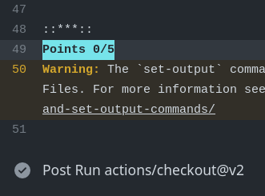

Multiclass Classifier

## Overview
implementation of  a multiclass classifier using the concepts of deep learning.

## Objectives
1. Enhance understanding of multiclass classification.
3. Implement and train a multiclass classifier model.
4. Evaluate the performance of the model.

---

## Validating and Evaluating Your Results

### Online
1. After committing and pushing your code, check the mark on the top line (near the commit ID).
2. If some tests are failing, click on the ❌ to open up a popup, which will show details about the errors.
3. You can click the [Details]() link to see what went wrong. Pay special attention to lines with the words "Failed" or "error".

4. Near the bottom of the [Details]() page, you can see your score. Here are examples of 0/5 and 5/5:

 

5. When you achieve a perfect score, you will see a green checkmark near the commit ID.

### Locally
1. You can test your code locally by installing and running `pytest` (`pip install pytest` or `conda install pytest`).
2. Run the tests using the command `pytest` in your terminal. This will show the status of each test and any errors that occurred.

Good luck!
